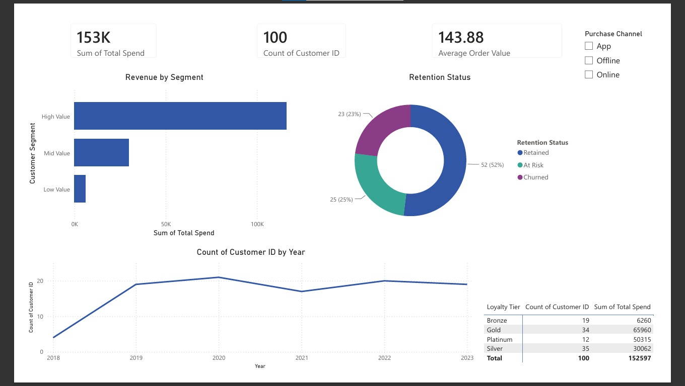

# 📊 Customer Segmentation & Retention Analytics in Power BI

## 📌 Project Objective
The goal of this project is to analyze customer behavior, segment the user base into profitable cohorts, and identify customers at risk of churn. This dashboard empowers marketing and product teams to make data-driven decisions to improve customer retention and maximize lifetime value.

## 🛠️ Tools Used
- **Power BI:** Data visualization, interactive filtering, and dashboard design.
- **Power Query:** Data cleaning and transformation.
- **DAX:** Formulating custom business logic and KPIs.

## 🗂️ Dataset Description
The dataset contains customer demographic and behavioral data, including:
- **Demographics:** Age, Gender, City, Income Level.
- **Behavioral:** Purchase Frequency, Total Spend, Average Order Value.
- **Status:** Retention Status (Retained, At Risk, Churned), Customer Segment, Loyalty Tier.

## 💡 Key Business Insights
- **Revenue Concentration:** The "High Value" segment drives the majority of the revenue, meaning marketing efforts should prioritize retaining these specific users.
- **Channel Performance:** App users show different retention behaviors compared to offline shoppers, signaling where the business should allocate its marketing budget.
- **Churn Risk:** A significant portion of "Mid Value" customers are currently flagged as 'At Risk', indicating an opportunity for targeted discount campaigns.

## 📸 Dashboard Preview

## 🏁 Conclusion
This dashboard provides a clear, high-level overview of customer health while allowing drill-downs into specific cohorts, making it an essential tool for CRM and Growth teams.
